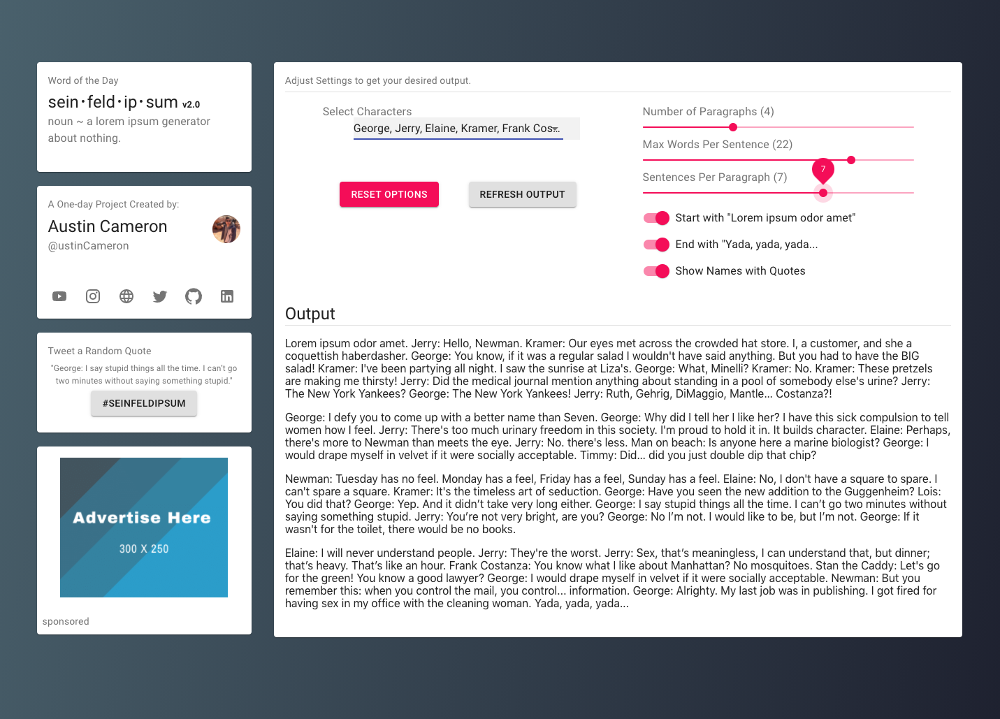

#  Seinfeld Lorem Ipsum Generator

[SeinfeldIpsum.com](https://SeinfeldIpsum.com) was a one-day challenge that became [quite popular](https://www.reddit.com/r/web_design/comments/1tyypm/i_made_a_seinfeld_lorem_ipsum_generator_because/) amongst designers and developers.

>This is **Version 2** - re-written using React & Material UI.
Now offering far more functionality.

## Features
- Ability to filter Quotes by Name/Characters.
- Ability to filter Quotes by Number of Words.
- Ability to adjust Output by Number of Paragraphs.
- Ability to adjust Output by Number of Sentences.
- Ability to toggle Output of Character Name.
- Ability to toggle Output of "Lorem ipsum odor amet" and "Yada, yada, yada".
- Ability to Tweet a Random Quote.

## Notes
- This repo does not contain the full `quotes.json` but does include an example.

## How to run the app
1. Clone the repo.
2. Run `npm i && npm start` to install packages and then navigate to localhost.

## Example
